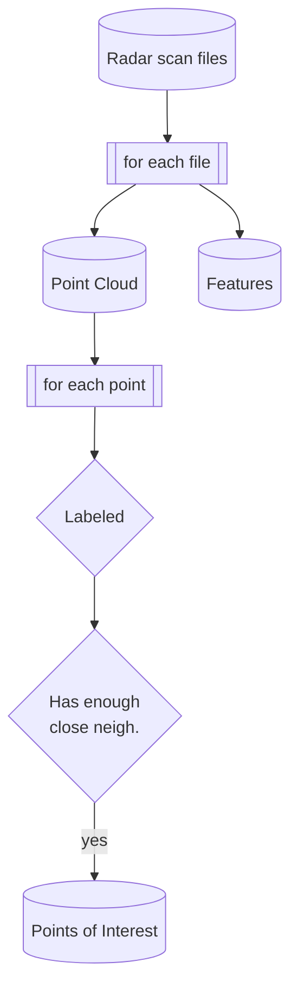
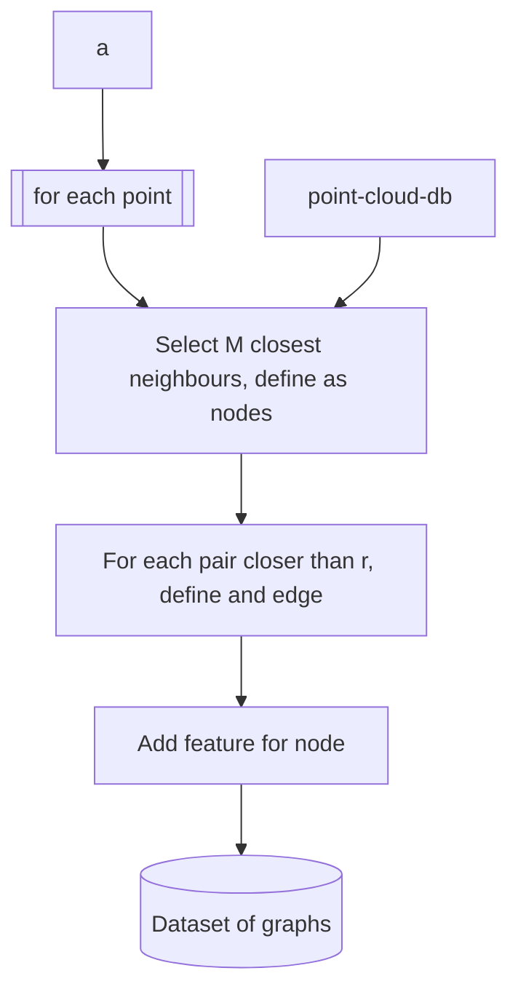

# Workflow

## Dataset

```mermaid
flowchart TD;
    files[(Radar scan files)]
    --> fef[[for each file]]
    --> point-cloud-db[(Point Cloud)]
    --> fep[[for each point]]
    --> filtering1{Labeled}
    --> filtering2{Has enough<br>close neigh.}
    --> |yes| filtered-db[(Points of Interest)];
    fef --> features-db[(Features)];
```

## Training

```mermaid
flowchart TD;
    a
    --> fepi[[for each point]]
    --> select[Select M closest neighbours, define as nodes]
    --> edge[For each pair closer than r, define and edge]
    --> addfeat[Add feature for node]
    --> dataset[(Dataset of graphs)];
    point-cloud-db --> select;
```
